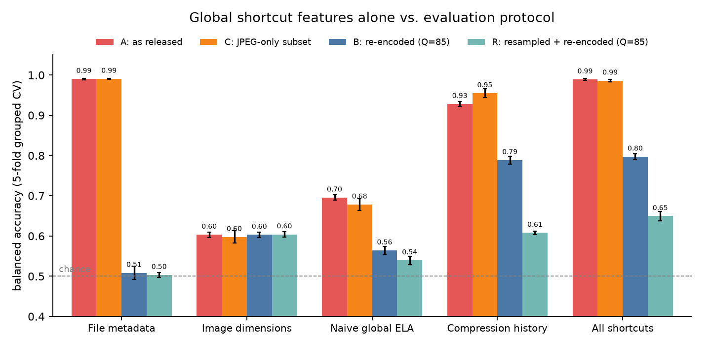
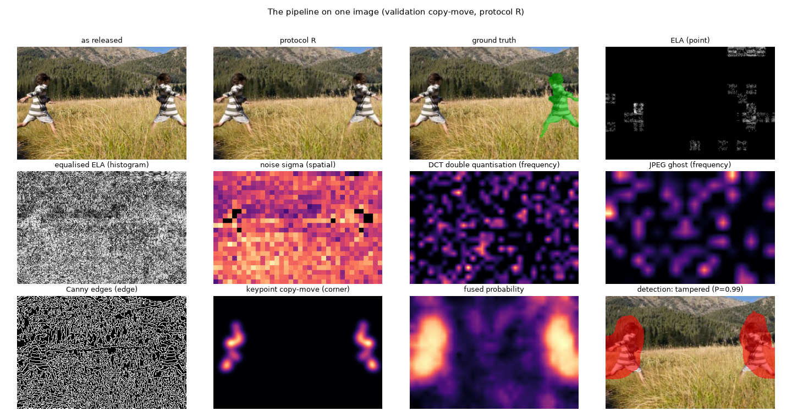
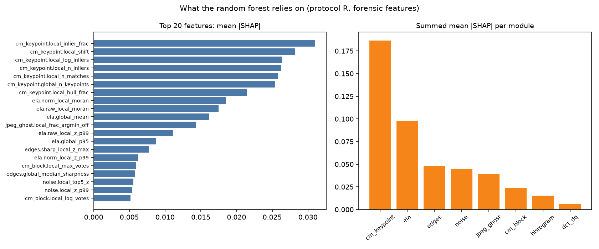
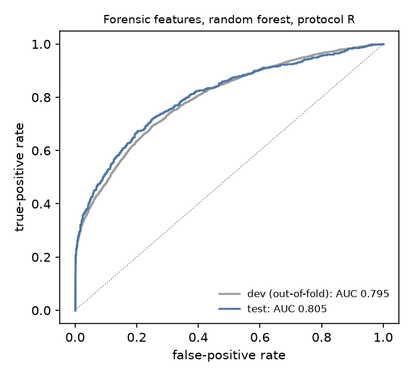
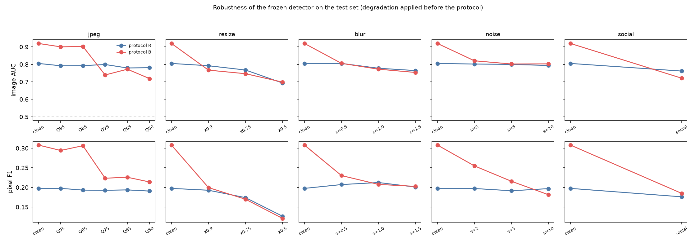
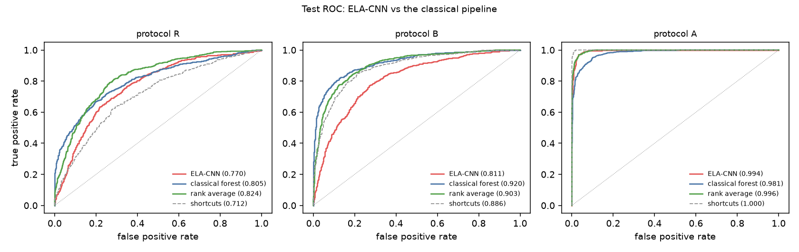

# Interpretable Classical Forgery Detection on CASIA v2.0

**Exposing format shortcuts and evaluating under leak-controlled protocols**
Smit Patel · EDS 6364 Digital Image Processing · final project

This is the readable summary of the project. The full IEEE-format report, with every table, the statistics and the appendices, is [`Patel_ImageForgeryDetection_report.pdf`](Patel_ImageForgeryDetection_report.pdf). All numbers below come from the saved pipeline outputs ([`outputs/metrics.json`](../outputs/metrics.json)).

---

## 1. Problem

A photograph can be forged in two main ways:
- **copy-move**: a region is duplicated inside the same image;
- **splicing**: a region is pasted in from another photograph.

The goal is to decide whether an image was tampered with and to show *where*. The detector uses only classical, interpretable image-processing evidence from the five technique families of the course: point processing, histogram processing, spatial filtering, frequency-domain filtering, and edge and corner detection.

## 2. Dataset, and why it leaks its labels

**CASIA v2.0** has 12,614 images: 7,491 authentic, and 5,123 tampered (3,295 copy-move, 1,828 splicing after correcting 99 labels). The tampered regions are small, with a median of 3.1 % of the image. The audit re-matched 142 misnamed masks, leaving 5,104 masks usable for pixel scoring.

| Class | Images | JPEG | TIFF | BMP |
|---|---:|---:|---:|---:|
| Authentic | 7,491 | 7,437 | 0 | 54 |
| Copy-move | 3,295 | 967 | 2,328 | 0 |
| Splicing | 1,828 | 1,097 | 731 | 0 |

**The benchmark as released can be solved without looking at the image content.**
- **Formats differ by class:** authentic images are never TIFF, and most tampered images are.
- **Compression tables differ too:** 89 % of authentic JPEGs use the standard IJG quantisation tables, and no tampered JPEG does.
- **Result:** a classifier that sees only **file metadata reaches 0.990 balanced accuracy** (AUC 0.999).

Any method trained on the raw files, including ELA, can therefore score highly without detecting tampering.

## 3. Leak-controlled protocols and a leakage-safe split

Every image is analysed under an explicit protocol:

| Protocol | What happens to every image | Balanced accuracy of all shortcut features |
|---|---|---:|
| **A** | nothing (files as released) | 0.989 |
| **C** | JPEG files only | 0.986 |
| **B** | re-encoded once as JPEG Q85 | 0.797 |
| **R** (main) | downscaled ×0.75, then re-encoded as JPEG Q85 | **0.649** |

A forensic feature counts only if it **beats these shortcuts under the same protocol**.

The split (train 8,828 / validation 1,894 / test 1,892) keeps together, in the same split:
- images from the same source;
- exact duplicates;
- verified near-duplicates.

The test split was frozen, by hash, before any model was trained.

## 4. Method: eight techniques from five course topics

Each module maps an image to an **evidence map** (for localisation) and to **scalar features** (for classification). The features are *within-image inconsistency* statistics, so a region is compared with the rest of its own image rather than with other images. Flat and clipped blocks carry no evidence and are masked out.

| Course topic | Module | Stage output (one validation copy-move, protocol R) |
|---|---|---|
| Point processing | Error level analysis (ELA), texture-normalised; JPEG ghosts | [`02a`](../outputs/02a_ela_residual_x10.png), [`02b`](../outputs/02b_ela_texture_normalised.png), [`05c`](../outputs/05c_jpeg_ghost.png) |
| Histogram processing | Equalised ELA, patch-histogram χ² distance | [`03a`](../outputs/03a_ela_equalised.png), [`03b`](../outputs/03b_histogram_before_after.png), [`03c`](../outputs/03c_chi2_distance.png) |
| Spatial filtering | Local noise level (high-pass residual, edges excluded) | [`04a`](../outputs/04a_noise_residual.png), [`04b`](../outputs/04b_noise_sigma.png) |
| Frequency domain | DCT double quantisation (permutation-tested periodicity); DCT block copy-move | [`05a`](../outputs/05a_dct_coefficient_histogram.png), [`05b`](../outputs/05b_dct_double_quantisation.png), [`06d`](../outputs/06d_copymove_blocks.png) |
| Edge and corner detection | Canny edge sharpness; SIFT keypoint copy-move with mirror matching and RANSAC (Harris was tested and rejected) | [`06a`](../outputs/06a_canny_edges.png), [`06b`](../outputs/06b_edge_sharpness.png), [`06c`](../outputs/06c_copymove_keypoints.png) |

The parameters were tuned by coordinate ascent on validation data only.

## 5. Classification (development set, grouped nested cross-validation)

The 82 features are fused by a **random forest**, which is compared with an **SVM**. Hyper-parameters are chosen inside each fold (nested CV), and confidence intervals come from paired group bootstrap.

Under protocol R the forensic features reach **AUC 0.795**, against **0.721** for the shortcut features. Added on top of the shortcuts they raise AUC by **+0.088 [0.078, 0.097]**. Under B the forensic features reach 0.910.

The forest is calibrated by isotonic regression, and the detector **abstains** inside an *uncertain band* (0.5 ± 0.24 under R), the smallest band that reaches 85 % accuracy on the images it judges. SHAP and module ablations show that copy-move keypoint matching and texture-normalised ELA carry most of the signal.

## 6. Localisation

The eight maps are fused on 8×8 cells by gradient boosting and post-processed into a mask. On authentic images the mask is removed when the classifier judges the image authentic ("gating"). This cuts authentic validation images showing a false region from 89 % to 42 % under R.

## 7. Test set, evaluated once (1,892 images)

| Protocol R | Test | Development estimate |
|---|---:|---:|
| Forensic features, AUC | **0.805 [0.779, 0.831]** | 0.795 |
| Shortcut features, AUC | 0.712 | 0.721 |
| Forensic + shortcuts − shortcuts, ΔAUC | **+0.103 [0.076, 0.129]** | +0.088 |

**Other protocols:** under B the forensic features reach 0.920. Under A, shortcut features alone reach 1.000.

At threshold 0.5 (forensic random forest):

| Protocol | Accuracy | Precision | Recall | F1 | Balanced accuracy |
|---|---:|---:|---:|---:|---:|
| R | 0.749 | 0.756 | 0.567 | 0.648 | 0.721 [0.695, 0.748] |
| B | 0.850 | 0.813 | 0.819 | 0.816 | 0.845 [0.826, 0.863] |

**Deployed calibrated detector (protocol R).** It judged **51.8 %** of the test images, with **86 % accuracy** (0.858) on those; a "tampered" verdict was right 94 % of the time.

| True class | Verdict: authentic | Verdict: tampered | Verdict: uncertain |
|---|---:|---:|---:|
| Authentic (1,123) | 619 | 13 | 491 |
| Tampered (769) | 126 | 222 | 421 |

**Localisation on test.**
- Pixel **F1 0.198 [0.179, 0.216]**, IoU 0.128 under R; F1 0.308 and IoU 0.210 under B.
- By region size (R): 0.040 for regions under 1 %, 0.148 for 1–5 % and 0.333 above 5 %.

**What it gets wrong.**
- **Missed forgeries** are mostly *splices*: 60 % of misses vs 3 % of detections, 22×. They are also concentrated in *low-keypoint* images (2.4×).
- **False alarms:** all 13 had copy-move keypoint matches that survived RANSAC, mostly self-similar scenes such as colonnades, lattices and repeated patterns.

## 8. Robustness and a second dataset

**Degradations** (protocol R, frozen models; each applied to the test images before the protocol):
- **Holds up:**
  - JPEG Q75 0.799, JPEG Q50 0.781;
  - noise σ = 10: 0.790.
- **Weaker:**
  - social-media-style upload 0.762;
  - downscaling ×0.5 0.693 (the main weakness).
- **Protocol B is fragile:** it falls from 0.920 to 0.739 after one JPEG Q75 re-save.

**Synthetic forgeries** with exact masks (R):
- copy-moves are found, AUC 0.885 when shifted and 0.896 when rotated and scaled;
- splices between two CASIA photographs are essentially undetectable (AUC 0.55–0.57).

**MICC-F220**, an unseen copy-move dataset used without retraining: **AUC 0.972 [0.933, 0.998]** under R, and 0.902 under B. Its forgeries come from only 11 scenes, so the interval is wide.

## 9. Deep-learning baseline: ELA + ResNet-18

An ImageNet-pretrained ResNet-18 was trained on ELA images, with the same splits and protocols. The comparisons and model hashes were pre-registered, and the test set was evaluated once.

| Test AUC | ELA-CNN | Classical |
|---|---:|---:|
| A (files as released) | **0.994** | 0.981 |
| B | 0.811 | **0.920** |
| R | 0.770 | **0.805** |
| MICC-F220 (R) | 0.529 [0.360, 0.700] | **0.972** |

**What these numbers show:**
- **A:** the CNN's 0.994 comes only on the leaking files, where the shortcut features alone reach 1.000.
- **R:** it trails the classical pipeline by 0.036 [0.005, 0.067], and it is not significantly better than a shortcut-feature SVM.
- **Splicing:** it is better than the classical forest here, but the shortcut features match that advantage.
- **Rank average:** averaging the two scores gives 0.824 under R, level with the best classical model (0.829).
- **MICC-F220:** its AUC is consistent with chance.

## 10. Validation, including what went wrong

The development process included independent code reviews. Several problems were caught and fixed before the test set was used:
- **DCT periodicity test:** it had a 16–48 % false-positive rate on wide histograms. It was replaced by a per-histogram **permutation null**, which gives 0–3 %, and 0.4 % on real history-free images. Some regular patterns are still missed: overall detection on simulated double compression is about 56 %.
- **`detect()` parameters:** the entry point used untuned module defaults instead of the tuned parameters. It now refuses a model whose recorded parameters differ.
- **Noise module:** flat patches became false low-noise outliers, now excluded per pixel.
- **Copy-move:** mirrored copies were missed, and unoriented keypoint pairs split one copy into two transforms. Both are fixed: the image is also matched against its mirror image, and pairs are oriented left to right before RANSAC.
- **CNN size check:** the pre-registered size check was invalid, because its tie-break followed label order. It was withdrawn and replaced by a post-hoc grouping by natural image size, which is reported as post-hoc.
- **Test-set use:** every use is logged with file fingerprints (headline run, robustness experiments, CNN comparison). Two early robustness runs were disclosed in a later note, and nothing was tuned on the test set.

A test suite of 209 automated tests (`tests/`) covers:
- the modules, on synthetic forgeries with known regions;
- the I/O, the protocols and the split invariants;
- the statistics;
- the interface.

## 11. Limitations

- Splices between photographs with the same processing history leave no inconsistency for these cues to find.
- Self-similar scenes cause copy-move false alarms.
- Localisation is coarse (8×8 cells), and regions under 1 % are rarely found.
- Only one external dataset (copy-move, 11 scenes) could be obtained.
- Under R the shortcuts still reach AUC 0.712, mainly through image size.

## 12. Reproducing

See the README section *Running it, step by step*. Every figure in `outputs/` is regenerated by `python scripts/make_outputs.py` after the pipeline has run.
